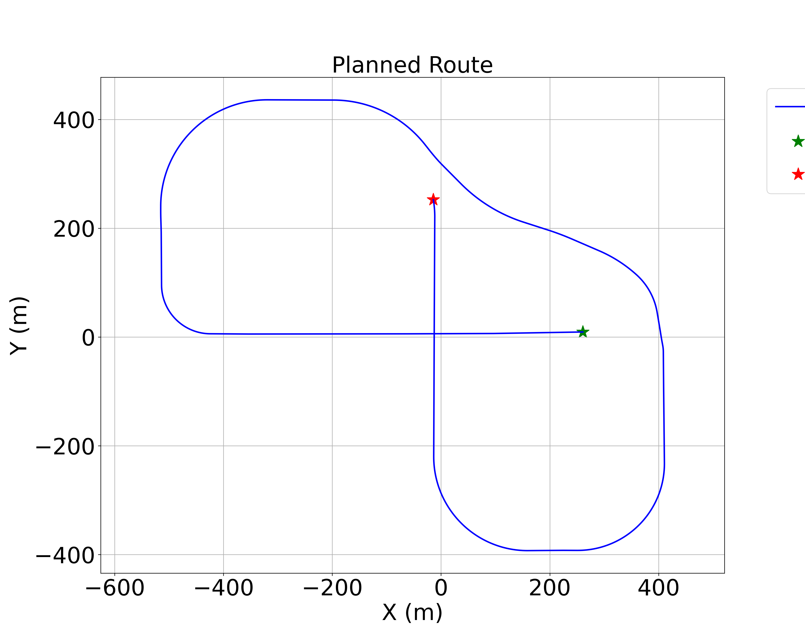

#  실험 TO-DO 리스트

- [ ] **Town03 일반화 실험** 
- [ ] **Town04 모델 재학습 및 저장** 
- [ ] **Town04 일반화 실험** 

# 1. Town04 모델 학습 및 저장

## 1. 실험 진행 상황 

### 1-1. Town03 모델 학습 및 저장 완료 
Town03 환경에서 제안 기법 및 베이스라인 모델(CQL, SAC, AWAC)에 대한 학습을 완료했습니다.
* **실험 횟수:** 각 모델별 6 seed 수행
* **저장 경로:** `logs/TOWN03_학습모델_로그_저장된모델` (로그 및 모델 포함)

### 1-2. 일반화 성능 실험 진행도 
현재 **Town01 ~ Town05** 환경에서의 일반화 성능 검증을 목표로 하고 있습니다. 진행 상황은 아래와 같습니다.

| 환경 (Map) | 제안 기법 (Ours) | SAC | CQL | AWAC | 비고 |
| :---: | :---: | :---: | :---: | :---: | :--- |
| **Town 01** | [x] 완료 | [x] 완료 | [ ] | [ ] | |
| **Town 02** | [x] 완료 | [x] 완료 | [ ] | [ ] | |
| **Town 04** | [ ] | [ ] | [ ] | [ ] | |
| **Town 05** | [ ] | [ ] | [ ] | [ ] | |

각 저장된 모델 별로 50 에피소드씩 주행을 수행하도록 하고 있습니다. 
나머지 기법에 대해 마저 실험이 필요합니다. 
**아래의 두 코드를 실행하면 나머지 일반화 성능 검증 실험이 실행되도록 설정해 두었습니다.**

```bash
- evaluate_sac_and_proposed.py 
- evaluate_cql_awac.py
```
---

### 1-3. Town04 실험 관련 변경, 문제 사항 

기존에 진행했던 Town04 실험 결과 에서 문제가 있었습니다. 설정된 경로가 한붓그리기처럼 단일 경로 형태가 아니어서 Waypoint 진행도 측정 및 주행 성능 평가에 모호함이 발생할 소지가 있음을 뒤늦게 깨달았습니다..
또한 Town04에서 AWAC의 경우에는 학습 경로가 다른 기법과 다르게 설정된 것을 확인했습니다

[이전 경로]


[수정된 경로]



따라서 만약 일반화 성능 검증을 위해 Town04에서 모델 학습 및 저장을 다시 해야 한다면 수정된 경로에서 학습 실행을 해 주시면 정말 감사드리겠습니다. 


**[데이터셋 경로 안내]**
Town04에서 수집한 Offline Dataset은 두 가지가 있습니다. 
기존 데이터셋은 경로 이미지만 있고 제가 경로를 생성할 때 랜덤으로 출발지점을 생성하여 구체적으로 출발 지점의 좌표를 모르는 문제가 있습니다.
따라서 새 데이터셋을 생성하여 현재 문서 아래에 각 경로를 생성할 때 설정한 경로 출발지점의 좌표를 적어두었습니다. 둘 중 사용하시기 조금 더 용이하신것으로 사용해 주시면 감사드리겠습니다!

dataset_town04_2 에서는 각 route마다 216개의 주행 trajectory가 저장되어 있습니다(.npz 형식)
하나의 .npz 파일 길이가 town03보다 약 2배 이상 차이가 나서 216개씩 수집했습니다.

만약, 추가 수집을 원한다면 `run.py` 파일의 **pid_control** 메서드의 **param_combinations** 부분에 조합을 더 추가하고 실행하면 추가로 수집할 수 있습니다. 

제 생각에는 새로 수집한 데이터셋(dataset_town04_2) 으로 replay buffer을 초기화하고 한번 학습을 해보는 것도 좋을 것 같습니다. `offline_data_for_replaybuffer/Town04_2_offline_data_경로` 에서 수집된 데이터의 그림을 보면 새로 수집한 경로가 좀 더 예쁘게 수집된 느낌이 있기 때문입니다! 

1.  **기존 데이터셋:** `offline_data_for_replaybuffer/dataset_town04`
2.  **새로 생성한 데이터셋:** `offline_data_for_replaybuffer/dataset_town04_2`
    


## 2. Town04 모델 학습 실험 실행 순서 

### 2-1. 사전 필수 체크리스트 

**[!!중요] 경로 설정 확인**
실험 시작 전, 각 모델 학습 파일의 `DATA_DIR` 경로가 현재 학습을 진행하고자 하는 Town의 Offline Data가 저장된 경로와 일치하는지 확인해야 합니다 

* **DATA_DIR 예시**: `offline_data_for_replaybuffer/dataset_town04_2`
* **LOGGING 경로 예시**: `SIMULATION = "TOWN4_제안기법_..."`


---

### 2-2. Town04에서 제안기법과 타 베이스라인 학습 실행 

*각 알고리즘별 6회 반복 실행*

#### 1. 제안기법 (Proposed Method)

* **사용하는 파일**: `run_proposed.py`
* **Action**: `DATA_DIR` 변수를 Town04 오프라인 데이터 경로로 변경 및 로깅 경로 설정 

```bash
python run_proposed.py 300 -100 Town04

```

#### 2. SAC

* **사용하는 파일**: `run_sac.py`
* **Action**: `DATA_DIR` 변수를 Town04 오프라인 데이터 경로로 변경 및 로깅 경로 설정 


```bash
python run_sac.py 300 -100 Town04

```

#### 3. CQL

* **사용하는 파일**: `cql_baseline.py`
* **Action**: `DATA_DIR` 변수를 Town04 오프라인 데이터 경로로 변경 및 로깅 경로 설정 
 

```bash
python run_sac.py 300 -100 Town04
```

#### 4. AWAC

* **사용하는 파일**: `awac_baseline.py`
* **Action**: `DATA_DIR` 변수를 Town04 오프라인 데이터 경로로 변경 및 로깅 경로 설정 

```bash
python run_sac.py 300 -100 Town04

```

### 2-3. 학습에서 발생한 로그 저장 및 plot 그리기 

#### 1. 각 metric을 csv 파일 형태로 다운받기 
각 실험별 폴더에 텐서보드 로깅 파일이 저장되어 있을 것입니다! 
많이 비효율적이라고 느끼실 지도 모르겠지만(ㅠㅠ) 저는 텐서보드를 열고, 그 안에서 csv 형식으로 다운로드를 받았습니다.

done_collided 의 경우, 해당 에피소드가 충돌로 끝날 시 1, 아니면 0으로 저장되고, 
done_reached 의 경우, 해당 에피소드가 도달로 끝날 시 1, 아니면 0으로 저장됩니다. 

```bash
tensorboard --logdir {텐서보드 로그 파일이 저장된 폴더 경로}
``` 

아래의 폴더 구조 처럼 각 metric 별로 폴더를 나누어 저장했습니다. 
각 파일의 이름은 
- waypoint_ahead_{기법이름}_{n}차.csv 
- done_collided_기법이름_{n}차.csv 
- done_reached_{기법이름}_{n}차.csv 
위의 형식으로 저장했습니다. 

```bash 
result 
  ㄴ Town03
    ㄴ waypoint_ahead
    ㄴ done_collided
    ㄴ done_reached 
  ㄴ Town04 
    ㄴ waypoint_ahead
    ㄴ done_collided
    ㄴ done_reached 
``` 

#### 2. waypoint ahead plot 그리기

* **사용하는 파일** : make_plot.py 

WAYPOINT_MAX 변수를 현재 town의 waypoint 개수에 맞게 변경하고, 
ROOT_DIR 경로를 데이터가 저장된 폴더 경로로 바꾸어주세요!! 
예를 들어, result/final_result_town3/waypoint_ahead 폴더에 데이터가 저장되어 있다면 아래처럼 바꾸어 주시면 됩니다.

```bash 
ROOT_DIR   = "result/final_result_town3"       
OUTPUT_DIR = os.path.join(ROOT_DIR, "plots")
```

그리고 위의 파일을 실행하면 (위에서 설정한 대로 경로 지정 시) result/final_result_town3/plots 폴더 안에 plot이 생성되어 저장됩니다. 


#### 3. done_reached, done_collided plot 그리기

* **사용하는 파일** : 

ROOT_DIR 경로를 데이터가 저장된 폴더 경로로 바꾸어주세요!!
 
예를 들어, result/final_result_town3/waypoint_ahead 폴더에 데이터가 저장되어 있다면 아래처럼 바꾸어 주시면 됩니다.

```bash 
ROOT_DIR   = "result/final_result_town3"       
OUTPUT_DIR = os.path.join(ROOT_DIR, "plots")
```

그리고 위의 파일을 실행하면 result/final_result_town3/plots 폴더 안에 plot이 생성되어 저장됩니다. 


# 2. Town04 일반화 실험 : 저장된 모델 로드 및 테스트

#### 타운별 테스트 시 주행 시작 포인트 (Start Points)

| Town | Coordinate (x, y) |
| --- | --- |
| **Town01** | (0, 0) |
| **Town02** | (250, 250) |
| **Town03** | (0, 0) |
| **Town04** | (300, -100) |
| **Town05** | (0, 0) |

---

#### 1. SAC & 제안기법 평가

* **Run File**: `evaluate_sac_and_proposed.py`

```python
if __name__ == "__main__":

    evaluate(
        "{모델이 저장된 경로}",
        episodes=50,
        max_steps_per_episode=30_000,
        deterministic=True,
        batch_size=256,
        render=False,
        category="제안기법",
        town="{테스트할 타운 (Town01/Town02/Town03/Town04/Town05)}",
        points=(타운별 주행 시작 포인트) 예 : (0,0)
    )

# 필요한 만큼 함수 호출 추가하여 사용 

```

#### 2️. CQL & AWAC 평가

* **Run File**: `evaluate_cql_awac.py`

```python
if __name__ == "__main__":
    
    # town과 시작 지점 설정 
    current_town = "{테스트할 타운 (Town01/Town02/Town03/Town04/Town05)}"
    start_pos = (300, -100)  

    test(
        model_path="{모델이 저장된 경로}", 
        start_point=start_pos,
        town=current_town,
        algo_type="{AWAC/CQL}",       
        run_name="{로깅할 폴더 이름 설정 (ex : AWAC_1차_실험 )}", 
        n_episodes=5
    )
    
    # 실험하려는 만큼 함수 호출 추가 

```

#### 3. plot 그리기 

테스트의 경우에도, 모델 학습 때와 같이 아래와 같은 구조로 데이터를 저장합니다.
- waypoint_ahead_{기법이름}_{n}차.csv 
- done_collided_기법이름_{n}차.csv 
- done_reached_{기법이름}_{n}차.csv 

```bash
{테스트 결과 저장 폴더명}
  ㄴ Town01
    ㄴ waypoint_ahead
    ㄴ done_collided
    ㄴ done_reached 
  ㄴ Town02
    ㄴ waypoint_ahead
    ㄴ done_collided
    ㄴ done_reached 
  ... 이후 Town 별 결과.. 
``` 

plot의 경우에는 2-3. 의 2번 처럼 make_plot.py , make_plot_collision_reached.py 코드를 이용해 그렸습니다. 


### 실험 관련 설정

####  TOWN03 오프라인 데이터 수집 경로

| ID | Start (x, y) | End (x, y)  |
| -- | ------------ | ----------- |
| 1  | (150, 50)    | (200, 50)   |
| 2  | (-125, 0)    | (0, -70)    |
| 3  | (150, 50)    | (50, 125)   |
| 4  | (0, 20)      | (-50, 150)  |
| 5  | (-150, 100)  | (-100, 0)   |
| 6  | (-100, -120) | (-100, -20) |
| 7  | (100, 58)    | (100, 80)   |

#### TOWN04 오프라인 데이터 수집 경로 (Start Points)


| ID | Start (x, y) |
| -- | ------------ |
| 1  | (0, 50)      |
| 2  | (0, 100)     |
| 3  | (-450, 350)  |
| 4  | (250, -100)  |
| 5  | (-350, 400)  |
| 6  | (200, 100)   |
| 7  | (100, 100)   |